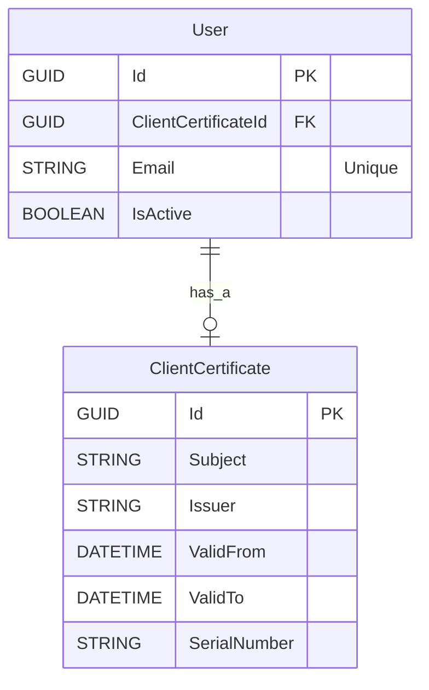

# Entity-Relationship Diagram

## Metadata
| **ID** | **Description** | Cross Reference links |
|--------|-----------------|----------------------|
| ERD-001 | Entity-Relationship Diagram | [Link to Doc][ERD-001-Doc] |

## Diagram

---
<!-- Links -->
[DM]: UseCases/UC001/Artifacts.md#
[UC001-ERD]: https://github.com/TirsvadWeb/DotNet.Portfolio/blob/main/docs/UseCases/UC001/Artifacts.md#er-diagram
